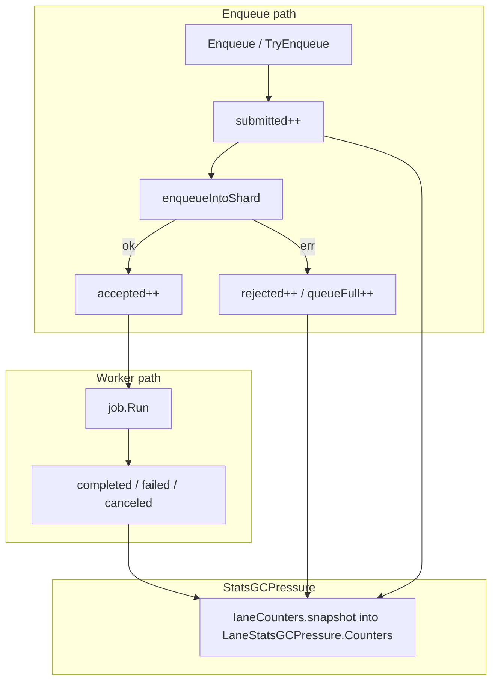

# KL-1202 — Per-Lane Counters

## Context

Spec: [`internalx/phases/KL-1202-add-per-lane-counters.md`](internalx/phases/KL-1202-add-per-lane-counters.md). Depends on KL-1201 ([`StatsGCPressure`](stats_gc_pressure.go), [`internal/core/stats_gc_pressure.go`](internal/core/stats_gc_pressure.go)).

**Naming:** Phase doc says `StatsV2()` / `LaneCountersV2`; the repo implements KL-1201 as **`StatsGCPressure()`**. This plan extends that API (no parallel `StatsV2` type) and bumps `StatsGCPressureVersion` to `"2"`.

**Already exists (v1 only):**

```18:26:internal/core/observability.go
type laneCounters struct {
    submittedTotal      atomic.Int64
    completedTotal      atomic.Int64
    failedTotal         atomic.Int64
    queueFullTotal      atomic.Int64
    queueWaitTotalNanos atomic.Int64
    queueWaitCount      atomic.Int64
}
```

Increment sites today ([`scheduler.go`](internal/core/scheduler.go) lines 100–104): `submittedTotal` only on **successful** enqueue; `queueFullTotal` on `ErrQueueFull`; `completedTotal`/`failedTotal` in [`process_shard.go`](internal/core/process_shard.go). **No** `Accepted`/`Rejected`/`Canceled`/`Panicked`. Counters are **not** exposed on `StatsGCPressure()`.



## API changes

Extend [`LaneStatsGCPressure`](stats_gc_pressure.go) with a nested counter struct (repo naming, same semantics as spec):

```go
type LaneCountersGCPressure struct {
    Submitted uint64  // every admission attempt after lane ID is known
    Accepted  uint64
    Rejected  uint64
    Completed uint64
    Failed    uint64
    QueueFull uint64
    Canceled  uint64  // documented; see semantics below
    Panicked  uint64  // always 0 until panic recovery exists
}

type LaneStatsGCPressure struct {
    // existing: LaneID, Name, Queued, InFlight, Capacity
    Counters LaneCountersGCPressure
}
```

- Bump [`StatsGCPressureVersion`](stats_gc_pressure.go) / core constant to **`"2"`**.
- Mirror types in [`internal/core/stats_gc_pressure.go`](internal/core/stats_gc_pressure.go); populate `Counters` in `StatsGCPressure()` via a copy helper on extended `laneCounters`.
- Deep-copy in [`queue.go`](queue.go) `Queue.StatsGCPressure()` (same pattern as KL-1201).
- **Do not** change v1 [`Stats`](stats.go) / [`LaneStats`](stats.go) field names or [`observability_test.go`](observability_test.go) expectations.

## Internal counter model

Add [`internal/core/lane_counters.go`](internal/core/lane_counters.go) (or extend [`observability.go`](internal/core/observability.go) if small):

| New atomic field | KL-1202 field | Notes |
|------------------|---------------|-------|
| `submitted` | Submitted | Every `Enqueue`/`TryEnqueue` attempt for a valid `LaneID` |
| `accepted` | Accepted | Successful `enqueueIntoShard` |
| `rejected` | Rejected | Any admission failure (incl. queue full, stopped, invalid lane push) |
| reuse `queueFullTotal` | QueueFull | Also `rejected++` on `ErrQueueFull` |
| reuse `completedTotal` / `failedTotal` | Completed / Failed | Worker terminal path |
| `canceled` | Canceled | See below |
| `panicked` | Panicked | Stay **0**; godoc: unsupported (no `recover` in job runner) |

Add `func (c *laneCounters) snapshotGCPressure() LaneCountersGCPressure` returning **copied** `uint64` values (no pointer to internals).

Keep v1 fields (`submittedTotal`, etc.) updating exactly as today so [`Queue.Stats()`](queue.go) and phase-6 docs remain valid.

## Counter semantics (implementation)

### Enqueue / TryEnqueue ([`scheduler.go`](internal/core/scheduler.go))

For each call with resolved `job.LaneID`:

1. `submitted.Add(1)` **first** (before `enqueueIntoShard`).
2. On `err == nil`: `accepted.Add(1)` and existing `submittedTotal.Add(1)` (v1).
3. On any error: `rejected.Add(1)`; if `errors.Is(err, ErrQueueFull)`: `queueFullTotal.Add(1)` (existing).
4. On `ErrStopped` / `ErrNotStarted` before shard enqueue: still `submitted` + `rejected` (admission failure).

Do **not** count pre-lane failures (`ErrInvalidLane` in [`submit.go`](submit.go), validation errors) — no stable lane counter.

### Worker terminal outcomes ([`process_shard.go`](internal/core/process_shard.go))

After `job.Run(ctx)`:

- `err == nil` → `completedTotal++` (existing).
- `errors.Is(err, context.Canceled)` → `canceled++` (not `failed`).
- else non-nil → `failedTotal++` (existing).

**Batch skip on worker `ctx.Err()`** (jobs popped but not run, lines 55–64): for each skipped job `j >= i`, `canceled++` once per job (accepted work canceled before execution). Document in godoc.

**Invariant** (tested): `completed + failed + canceled + panicked <= accepted` (panicked = 0 for now). Queue-full: `submitted >= accepted + rejected` and `queueFull <= rejected`.

### Panic

No scheduler panic recovery today — `Panicked` remains 0; document as unsupported in `LaneCountersGCPressure` godoc.

## Implementation steps

1. **Extend `laneCounters`** + `snapshotGCPressure()` in new [`internal/core/lane_counters.go`](internal/core/lane_counters.go).
2. **Update increment logic** in `Enqueue`, `TryEnqueue`, `process_shard.go` per semantics above.
3. **Wire snapshot** — in `StatsGCPressure()`, set `lanes[i].Counters = s.laneCounters[i].snapshotGCPressure()` (map existing totals into `Completed`/`Failed`/`QueueFull` fields).
4. **Public types** — extend [`stats_gc_pressure.go`](stats_gc_pressure.go), adapter in [`queue.go`](queue.go); version `"2"`.
5. **Godoc** on `LaneCountersGCPressure` and each field: cumulative since scheduler start, best-effort under concurrency, diagnostics only (per spec).
6. **Tests** — see below.
7. **Benchmark guardrail** — re-run / document [`BenchmarkSubmitHotPathAllocGuardrail`](submit_bench_test.go); confirm no new allocs/op on enqueue after counter wiring (atomics only).

## Tests

### Core — [`internal/core/lane_counters_test.go`](internal/core/lane_counters_test.go)

| Test | Asserts |
|------|---------|
| `TestLaneCountersZeroedAtInit` | New scheduler: all GCPressure counters 0 per lane |
| `TestLaneCountersSubmitAccepted` | Enqueue success → Submitted=1, Accepted=1, Rejected=0 |
| `TestLaneCountersQueueFull` | Fill bounded lane → Submitted≥Accepted+Rejected, QueueFull==Rejected count, no Accepted on full |
| `TestLaneCountersCompletedFailed` | Worker run nil/error → Completed/Failed |
| `TestLaneCountersCanceled` | Job returns `context.Canceled` → Canceled++, Failed unchanged |
| `TestLaneCountersMultiLaneIsolation` | Traffic on lane A does not bump lane B |
| `TestLaneCountersSnapshotImmutable` | Mutate returned snapshot; re-read unchanged |
| `TestLaneCountersTerminalInvariant` | `completed+failed+canceled+panicked <= accepted` after drain |

Reuse KL-1201 patterns: `Stop(ctx, true)` for drain instead of `time.Sleep` where waiting for terminal counts ([`stats_gc_pressure_test.go`](stats_gc_pressure_test.go)).

### Public — extend [`stats_gc_pressure_test.go`](stats_gc_pressure_test.go)

- Mirror core scenarios via `Queue.StatsGCPressure().Lanes[i].Counters`.
- `TestLaneCountersConcurrentSubmitRunAndStatsGCPressure` — parallel submitters + repeated `StatsGCPressure`; use existing `checkStatsGCPressureSane` plus monotonic counter checks (`Submitted` never decreases).
- Extend [`race_test.go`](race_test.go) optional: concurrent `StatsGCPressure` while submitting (if not already covered).

### v1 regression

Run existing [`observability_test.go`](observability_test.go) lane counter section unchanged — confirms v1 `SubmittedTotal` still means successful enqueue.

## Documentation

- Godoc on new types/fields (required by spec).
- [`docs/phase-6-observability.md`](docs/phase-6-observability.md) — short note: cumulative lane counters live on `StatsGCPressure` (v2); v1 `Stats()` retains legacy throughput fields.
- [`docs/debugging.md`](docs/debugging.md) — when to use pressure snapshot counters vs v1 totals.

## Out of scope

Per spec: no Prometheus/OpenTelemetry, queue-wait/run-duration, slow-job hooks, scheduling changes, per-job label maps.

## Verification

```bash
go test ./...
go test -race ./...
go test -bench='BenchmarkSubmit' -benchmem .
```

## Risks

| Risk | Mitigation |
|------|------------|
| v1 semantic drift | Keep `submittedTotal` increment path unchanged; new `submitted` field for KL-1202 only |
| Hot-path allocs | Pre-sized `[]laneCounters`; atomic adds only |
| Canceled vs failed | Explicit `errors.Is(err, context.Canceled)` branch |
| Counter contention | Same pattern as existing per-lane atomics |

## Definition of done

Matches KL-1202 acceptance criteria: counters on `StatsGCPressure`, all increment paths tested, canceled/panicked documented, v1 compatible, race-clean, submit bench guardrail, ready for KL-1203+.
