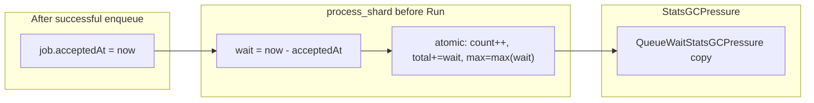

# KL-1203 — Track Queue Wait Duration

## Context

Spec: [`internalx/phases/KL-1203-track-queue-wait-duration.md`](internalx/phases/KL-1203-track-queue-wait-duration.md). Builds on KL-1201/KL-1202 ([`StatsGCPressure`](stats_gc_pressure.go), [`LaneCountersGCPressure`](internal/core/lane_counters.go)).

**Repo naming:** Phase doc uses `StatsV2` / `QueueWaitStatsV2`; implementation is **`StatsGCPressure()`** (version currently `"2"` → bump to **`"3"`** when adding queue-wait fields).

**User choice:** Queue wait for **StatsGCPressure is always on** (separate from v1 `TrackQueueWait` opt-in).

### What exists today

| Area | Today | KL-1203 gap |
|------|--------|-------------|
| Timestamp | `EnqueuedAt` set **before** `enqueueIntoShard` when `TrackQueueWait` ([`scheduler.go`](internal/core/scheduler.go) ~97–98) | Must be **after** successful admission only |
| Accumulators | Per-lane `queueWaitCount` / `queueWaitTotalNanos` in [`laneCounters`](internal/core/lane_counters.go), opt-in only | No **MaxNanos**, no **global**, no **per-shard**, not on **StatsGCPressure** |
| Snapshot | v1 [`LaneStats`](stats.go) + `AverageQueueWait()` | No queue wait on `StatsGCPressureSnapshot` |
| Tests | [`observability_test.go`](observability_test.go) §3 (opt-in v1) | Need StatsGCPressure + rejected/max/blocking tests |



## API changes

Add types (repo naming) to [`stats_gc_pressure.go`](stats_gc_pressure.go) and [`internal/core/stats_gc_pressure.go`](internal/core/stats_gc_pressure.go):

```go
type QueueWaitStatsGCPressure struct {
    Count      uint64
    TotalNanos uint64
    MaxNanos   uint64
}

// Allocation-free helpers on public type:
func (s QueueWaitStatsGCPressure) AverageNanos() uint64
func (s QueueWaitStatsGCPressure) AverageDuration() time.Duration
func (s QueueWaitStatsGCPressure) MaxDuration() time.Duration
```

Extend snapshots:

| Struct | New field |
|--------|-----------|
| `StatsGCPressureSnapshot` | `QueueWait QueueWaitStatsGCPressure` (global) |
| `LaneStatsGCPressure` | `QueueWait QueueWaitStatsGCPressure` |
| `ShardStatsGCPressure` | `QueueWait QueueWaitStatsGCPressure` |

Deep-copy in [`queue.go`](queue.go) `Queue.StatsGCPressure()` like existing fields.

**v1 unchanged:** `Config.Observability.TrackQueueWait` continues to gate v1 `LaneStats.QueueWait*` only; existing [`observability_test.go`](observability_test.go) tests must pass without behavior change.

## Internal model

### New file: [`internal/core/queue_wait.go`](internal/core/queue_wait.go)

```go
type queueWaitAccum struct {
    count      atomic.Uint64
    totalNanos atomic.Uint64
    maxNanos   atomic.Uint64
}

func (a *queueWaitAccum) record(waitNanos uint64)
func (a *queueWaitAccum) snapshot() QueueWaitStatsGCPressure
func atomicMaxUint64(target *atomic.Uint64, value uint64) // CAS loop per spec
```

### Scheduler ([`scheduler.go`](internal/core/scheduler.go))

- `queueWaitGlobal queueWaitAccum`
- `shardQueueWait []queueWaitAccum` (len = shardCount)
- Per-lane: add `queueWaitMaxNanos atomic.Uint64` to `laneCounters` (reuse existing count/total for **GC pressure** always-on path, or add parallel `gcQueueWait*` atomics to avoid coupling with v1 opt-in — **prefer parallel `gcQueueWaitCount/Total/Max` on `laneCounters`** so v1 opt-in counters stay independent)

**Recommended:** three always-on fields on `laneCounters`:

- `gcQueueWaitCount`, `gcQueueWaitTotalNanos`, `gcQueueWaitMaxNanos`

v1 keeps `queueWaitCount` / `queueWaitTotalNanos` behind `TrackQueueWait` only.

### Job metadata ([`internal/core/job.go`](internal/core/job.go))

- Add `AcceptedAt int64` (Unix nanos, monotonic-safe via `time.Now().UnixNano()`).
- Set **only** after `enqueueIntoShard` succeeds in `Enqueue` / `TryEnqueue` (always, not gated).
- Leave `EnqueuedAt` + `TrackQueueWait` path as-is for v1 (set before enqueue today — optional small fix to move v1 timestamp after accept in same PR for correctness, or leave v1 behavior to avoid test churn — **plan: fix v1 to set `EnqueuedAt` after accept when `TrackQueueWait`**, aligns both paths; update v1 tests if needed).

### Worker path ([`internal/core/process_shard.go`](internal/core/process_shard.go))

Immediately before `job.Run(ctx)` (not on completion):

```go
if job.AcceptedAt > 0 {
    wait := time.Now().UnixNano() - job.AcceptedAt
    s.recordGCPressureQueueWait(shardID, job.LaneID, uint64(wait))
}
```

`recordGCPressureQueueWait` updates global + lane `gcQueueWait*` + `shardQueueWait[shardID]`; uses `atomicMaxUint64` for max.

**Rejected / queue-full:** no `AcceptedAt` → no wait sample (KL-1202 rejected path).

**v1 `TrackQueueWait`:** keep separate increment in `process_shard` using `EnqueuedAt` (or switch v1 to `AcceptedAt` if v1 timestamp moved).

**Skipped jobs on worker ctx cancel:** no `Run()` → no queue wait sample (correct).

## StatsGCPressure collector

In [`StatsGCPressure()`](internal/core/stats_gc_pressure.go):

- `snap.QueueWait = s.queueWaitGlobal.snapshot()`
- Per lane: `lanes[i].QueueWait` from `laneCounters[i].gcQueueWait*`
- Per shard: `shards[i].QueueWait` from `shardQueueWait[i]`

Godoc: queue wait is time from admission to start of `Run()`; excludes run duration and caller latency; best-effort across fields (same pattern as KL-1202 counters). Do not require `sum(lanes) == global` under concurrency in tests.

## Implementation steps

1. Add `queue_wait.go` (accumulator, `atomicMaxUint64`, `recordGCPressureQueueWait`).
2. Extend `laneCounters` + `scheduler` with GC-pressure queue-wait atomics.
3. Add `AcceptedAt`; set after successful enqueue; wire `process_shard` recording.
4. Extend public/core `StatsGCPressure` types, collector, `queue.go` adapter; version `"3"`.
5. Add helper methods on public `QueueWaitStatsGCPressure`.
6. Tests (below).
7. Benchmarks + docs.

## Tests

### Core — [`internal/core/queue_wait_test.go`](internal/core/queue_wait_test.go)

| Test | Asserts |
|------|---------|
| Accepted job | `Count==1`, `TotalNanos>0`, `MaxNanos>0` |
| Rejected / queue-full | all zero |
| Blocking B behind A | B `MaxNanos>0`, `Total>=Max` when count≥1 |
| Max monotonic | second shorter wait does not lower `MaxNanos` |
| Per-lane isolation | lane B zero when only lane A traffic |
| Per-shard | shard with traffic has `QueueWait.Count>0` |
| Not run duration | long `Run()` does not increase wait total |
| Snapshot immutability | mutate snapshot; re-read unchanged |
| v1 opt-in off | GC stats still increment; v1 `QueueWaitCount==0` |

Use blocking + `Stop( drain)` patterns from [`stats_gc_pressure_test.go`](stats_gc_pressure_test.go) (no flaky exact nanoseconds).

### Public — extend [`stats_gc_pressure_test.go`](stats_gc_pressure_test.go)

- Mirror core scenarios via `Queue.StatsGCPressure()`.
- `TestQueueWaitConcurrentSubmitAndStats` — parallel submit/read; sanity bounds (no negative, max≥avg when count>0); **do not** assert `Submitted` style invariants on queue-wait sums across torn reads.
- Extend [`checkStatsGCPressureSane`](stats_gc_pressure_test.go) with loose queue-wait bounds if needed.

### Regression

- Run full [`observability_test.go`](observability_test.go) (v1 opt-in).
- `go test -race ./...`

## Benchmarks

Add to [`stats_gc_pressure_bench_test.go`](stats_gc_pressure_bench_test.go) or new [`queue_wait_bench_test.go`](internal/core/queue_wait_test.go):

- `BenchmarkRecordGCPressureQueueWait` (atomic update path)
- Re-run [`BenchmarkSubmitHotPathAllocGuardrail`](submit_bench_test.go) — document expected +1 int64 store on accept (`AcceptedAt`)
- `BenchmarkStatsGCPressure` with queue-wait fields

## Documentation

- Godoc on `QueueWaitStatsGCPressure` and helpers.
- [`docs/phase-6-observability.md`](docs/phase-6-observability.md): queue wait on `StatsGCPressure` (always on) vs v1 `TrackQueueWait` (opt-in); depth vs counters vs wait vs run (KL-1204).
- [`docs/debugging.md`](docs/debugging.md): when high queue wait implies worker/shard/lane pressure.

## Out of scope

Per spec: Prometheus/OTel, run duration (KL-1204), histograms, slow-job hooks, scheduling/admission changes.

## Risks

| Risk | Mitigation |
|------|------------|
| Hot-path cost always on | One int64 store on accept + 3 atomics at job start; no maps/allocs |
| v1 test breakage if moving EnqueuedAt | Move v1 timestamp after accept only when `TrackQueueWait`; run observability tests |
| Max race | CAS loop + `-race` |
| Flaky timing tests | Blocking jobs; inequality assertions only |
| Snapshot skew | Document best-effort; no strict global=sum(lanes) under race |

## Verification

```bash
go test ./...
go test -race ./...
go test -bench='BenchmarkSubmit|BenchmarkStatsGCPressure|QueueWait' -benchmem ./...
```
