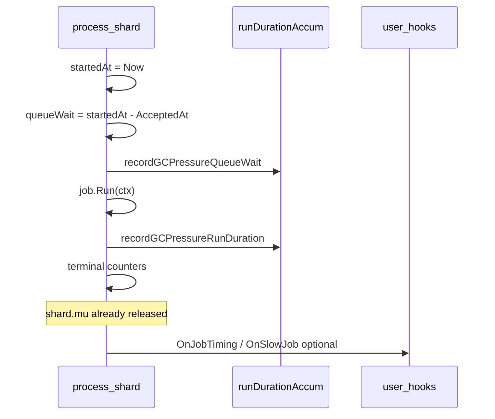

# KL-1204 — Runtime duration tracking and observability hooks

## Context and naming

The phase doc uses **Stats v2** / `RunStatsV2`; the repo implements this as **[`StatsGCPressure()`](stats_gc_pressure.go)** / `RunStatsGCPressure`, following KL-1201–1203. **Version bumps to `"4"`** (after `"3"` = queue wait).

KL-1203 already provides:
- `AcceptedAt` on queued jobs ([`internal/core/job.go`](internal/core/job.go), stamped after successful `push` in [`enqueue.go`](internal/core/enqueue.go))
- Always-on `recordGCPressureQueueWait` in [`process_shard.go`](internal/core/process_shard.go)
- Partial slow-job hook: `SlowJobThreshold` + `OnSlowJob` with **run-only** `Duration` ([`hooks.go`](hooks.go))

KL-1204 fills the gap: **cumulative run stats** + **`OnJobTiming`** + **rich hook events** (queue wait + run duration + outcome).



---

## 1. Run duration accumulation (mirror KL-1203)

Add [`internal/core/run_duration.go`](internal/core/run_duration.go) duplicating the [`queueWaitAccum`](internal/core/queue_wait.go) pattern:

- `runDurationAccum` with `count`, `totalNanos`, `maxNanos` atomics + `record()` + `snapshot()` → `RunStatsGCPressure`
- `recordGCPressureRunDuration(shardID, laneID, runNanos)` updating:
  - `s.runDurationGlobal` (new field on [`Scheduler`](internal/core/scheduler.go), beside `queueWaitGlobal`)
  - `s.shardRunDuration[shardID]` (new slice, init in `NewScheduler` like `shardQueueWait`)
  - per-lane atomics on [`laneCounters`](internal/core/lane_counters.go): `gcRunCount`, `gcRunTotalNanos`, `gcRunMaxNanos` + `snapshotGCPressureRun()`

**Always on** for accepted jobs that reach `Run()` (same policy as queue wait). Rejected admissions never run → no run sample.

### Public / core API types

| File | Change |
|------|--------|
| [`stats_gc_pressure_run.go`](stats_gc_pressure_run.go) (new, public) | `RunStatsGCPressure` + `AverageNanos` / `AverageDuration` / `MaxDuration` helpers (copy [`stats_gc_pressure_queue_wait.go`](stats_gc_pressure_queue_wait.go)) |
| [`internal/core/stats_gc_pressure.go`](internal/core/stats_gc_pressure.go) | Add `Run RunStatsGCPressure` to `StatsGCPressureSnapshot`, `ShardStatsGCPressure`, `LaneStatsGCPressure`; bump `StatsGCPressureVersion` to `"4"` |
| [`stats_gc_pressure.go`](stats_gc_pressure.go) | Mirror public structs |
| [`internal/core/stats_gc_pressure.go`](internal/core/stats_gc_pressure.go) `StatsGCPressure()` | Wire global / shard / lane run snapshots |
| [`queue.go`](queue.go) `StatsGCPressure()` | Deep-copy `Run` fields (add `copyRunStatsGCPressure` beside `copyQueueWaitStatsGCPressure`) |

Optional sanity in [`checkStatsGCPressureSane`](stats_gc_pressure_test.go): loose bound `Run.Count <= terminal + 1` per lane (same tolerance style as admission counters).

---

## 2. Refactor `process_shard` execution timing

In [`internal/core/process_shard.go`](internal/core/process_shard.go), replace the split queue-wait / slow-job clock logic with one flow **outside `shard.mu`**:

```go
startedAt := time.Now()
var queueWait time.Duration
if !job.AcceptedAt.IsZero() {
    queueWait = startedAt.Sub(job.AcceptedAt)
    s.recordGCPressureQueueWait(shardID, job.LaneID, uint64(queueWait.Nanoseconds()))
}
// v1 TrackQueueWait path unchanged (EnqueuedAt + laneCounters queueWait*)

err := job.Run(ctx)
runDuration := time.Since(startedAt)
s.recordGCPressureRunDuration(shardID, job.LaneID, uint64(runDuration.Nanoseconds()))

// outcome + KL-1202 terminal counters (existing err == nil / Canceled / failed)
emitObservabilityHooks(s, shardID, job.LaneID, queueWait, runDuration, err)
```

**Rules (per spec):**
- `startedAt` is always taken before `Run()` when recording run stats (not gated on `SlowJobThreshold`).
- Queue wait for hooks reuses the `queueWait` computed at start — **no second queue-wait sample**.
- Hooks run **after** terminal counters, still inside the per-job closure but **after** `shard.mu.Unlock()` (already true).
- **No user panic recovery** today — document that `JobOutcomePanicked` is reserved and hooks are not guaranteed on panic; `Panicked` counter stays 0.

Extract hook emission to [`internal/core/observability_hooks.go`](internal/core/observability_hooks.go) (new) to keep `process_shard` readable.

---

## 3. Hook and config API (public + internal)

### Extend [`hooks.go`](hooks.go)

```go
type Hooks struct {
    OnJobTiming func(JobTimingEvent)
    OnSlowJob   func(SlowJobEvent)
}

type JobTimingEvent struct {
    ShardID     int
    LaneID      uint16
    Lane        Lane      // name; keep Lane string type for consistency with existing API
    QueueWait   time.Duration
    RunDuration time.Duration
    Outcome     JobOutcome
}

type SlowJobEvent struct {
    ShardID     int
    LaneID      uint16
    Lane        Lane
    QueueWait   time.Duration
    RunDuration time.Duration
    Threshold   time.Duration
    Outcome     JobOutcome
}

type JobOutcome uint8
const (
    JobOutcomeCompleted JobOutcome = iota
    JobOutcomeFailed
    JobOutcomeCanceled
    JobOutcomePanicked // unused until panic recovery exists
)
```

**Breaking change:** remove `SlowJobEvent.Duration`; callers use `RunDuration`. Update [`observability_test.go`](observability_test.go) and [`docs/phase-6-observability.md`](docs/phase-6-observability.md).

### [`internal/core/observability.go`](internal/core/observability.go)

- Add `OnJobTiming func(...)` (or internal struct callback)
- Replace `OnSlowJob func(lane string, shardID int, duration time.Duration)` with rich signature matching events
- Map outcomes from `errors.Is(err, context.Canceled)` → `JobOutcomeCanceled`, nil → `Completed`, else `Failed`

### [`queue.go`](queue.go) wiring

Wire `Hooks.OnJobTiming` and updated `OnSlowJob` into `sched.Obs` (same pattern as current `OnSlowJob` closure).

### Hook semantics

| Hook | When | Overhead when disabled |
|------|------|------------------------|
| `OnJobTiming` | After every completed `Run()` if non-nil | Branch only |
| `OnSlowJob` | `SlowJobThreshold > 0` **and** non-nil **and** `runDuration >= threshold` | No `time.Now()` for slow-only path alone — `startedAt` still taken for run stats |
| `SlowJobThreshold <= 0` | Disables slow detection only | Run stats still recorded |

**Hook panic policy (spec Option A):** `defer recover()` in hook dispatcher so observer panics do not kill workers. Add `TestHookPanicDoesNotKillWorker`.

**Lane name lookup:** only when `OnJobTiming != nil` or slow hook may fire (avoid `laneReg.Name` on every job when both hooks nil).

---

## 4. Tests

### Internal — [`internal/core/run_duration_test.go`](internal/core/run_duration_test.go)

- Success / failed / canceled job each record exactly one run sample
- Rejected / queue-full / stopped admission: `Run.Count == 0`
- Count, total, max behavior; per-lane isolation; per-shard isolation (if wired)
- `TestRunDurationGlobalEqualsSumOfLanes` (mirror KL-1203 global-vs-lane sum invariant, sequential drain)
- Snapshot immutability (mutate `snap.Run`, re-read)

### Public — extend [`stats_gc_pressure_test.go`](stats_gc_pressure_test.go)

- `StatsGCPressure` exposes `Run` at global / lane / shard
- `TestRunDurationGCPressureGlobalEqualsSumOfLanes`

### Hooks — extend [`observability_test.go`](observability_test.go)

- `OnJobTiming` receives `QueueWait`, `RunDuration`, `Outcome`
- `OnSlowJob` fires / does not fire (threshold, below threshold, threshold zero)
- Nil hooks no panic
- Hooks after completion (ordering / not under shard lock — existing `TestSlowJobHookNotCalledInsideShardLock` pattern)
- Hook panic recovery test
- Update `TestSlowJobEventFields` for new shape

### Concurrency — [`stats_gc_pressure_test.go`](stats_gc_pressure_test.go) or [`race_test.go`](race_test.go)

- `TestRuntimeDurationConcurrentSubmitRunStatsAndHooks` per spec: parallel submit + `StatsGCPressure` readers + lightweight hooks; assert sane under `-race`

---

## 5. Benchmarks and docs

| Item | Action |
|------|--------|
| [`internal/core/process_shard_bench_test.go`](internal/core/process_shard_bench_test.go) or new bench | Compare no hooks / nil hooks / lightweight hooks (spec benchmark check) |
| [`docs/phase-6-observability.md`](docs/phase-6-observability.md) | Document `StatsGCPressure().Run`, queue wait vs run duration, hook fields; fix “no timing when threshold 0” → run stats always on, slow hook gated |
| [`docs/debugging.md`](docs/debugging.md) | Operational examples from spec (high queue wait vs high run duration) |
| [`docs/benchmarks.md`](docs/benchmarks.md) | Note version `"4"` and run-stats hot-path cost |

**Do not edit** `.cursor/plans/` files.

---

## 6. Verification

```bash
go test ./...
go test -race ./...
go test -bench='BenchmarkProcessShard|Hook|RunDuration|StatsGCPressure' -benchmem ./internal/core/... ./...
```

---

## Out of scope (explicit)

- User job panic recovery / `JobOutcomePanicked` in production paths
- Prometheus / OpenTelemetry / histograms
- Async hook dispatcher
- Changes to admission, quotas, or `Submit` semantics
