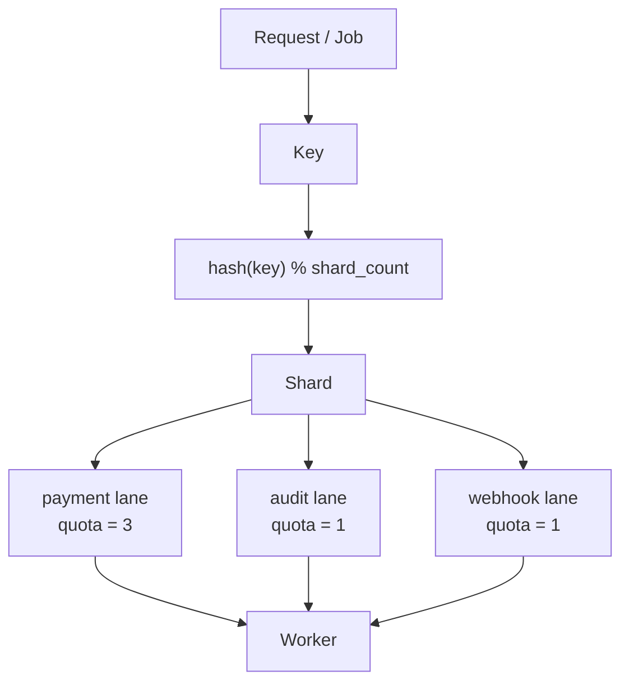

# go-keylane
A Go library for routing jobs by key into deterministic execution lanes, improving fairness, isolation, and tail-latency control in backend services.

It helps Go services execute asynchronous jobs more fairly by routing work through:

- **Key**: business identity such as tenant, customer, account, order, or user
- **Lane**: job class such as payment, audit, webhook, email, or enrichment
- **Shard**: concurrency isolation bucket derived from the key
- **Quota**: per-lane execution allowance
- **Worker**: goroutine that processes ready shards

## Mental Model



## What go-keylane is

`go-keylane` is an in-process execution control library for Go services.

It is designed to help with:

* noisy tenant/key isolation
* fairer execution between job classes
* bounded queueing
* controlled worker goroutine count
* lower allocation pressure through bounded internal structures

## What go-keylane is not

`go-keylane` is not:

* a replacement for the Go scheduler
* a replacement for the OS scheduler
* a distributed queue
* a Redis/Postgres-backed job system
* a guarantee that code will always run faster
* a way to avoid Go GC pauses

`go-keylane` may help reduce GC pressure caused by uncontrolled concurrency, goroutine explosion, and allocation bursts, but it does not eliminate garbage collection.

## Example Use Case

A payment service may want to process work by customer:

* `payment` lane gets higher quota
* `audit` lane gets lower quota
* `webhook` lane gets bounded background execution
## Core Data Model

`go-keylane` uses a simple but powerful data model to define how work is processed.

### Config
The `Config` struct defines the global settings for the keylane instance.

```go
type Config struct {
	ShardCount       int
	WorkerCount      int
	QueueSizePerLane int
	LaneQuotas       map[Lane]int
}
```

### Lane
A `Lane` is a string identifier for a job class. Each lane has its own quota and queue.

```go
type Lane string
```

### Job
A `Job` is a unit of work that contains a routing key, a lane, and the function to execute.

```go
type Job struct {
	Key  string
	Lane Lane
	Run  func(context.Context) error
}
```

### Getting Started

> [!IMPORTANT]
> `go-keylane` is currently in an **experimental, pre-v0.1 state**. Phase 1 establishes the core data model; shard routing, queue implementation, and worker scheduling are not yet active.

Internal models such as `InternalJob` and `LaneRegistry` are not part of the public API and are subject to change without notice.

```go
cfg := keylane.Config{
	ShardCount:       64,
	WorkerCount:      4,
	QueueSizePerLane: 1024,
	LaneQuotas: map[keylane.Lane]int{
		"payment": 3,
		"audit":   1,
		"webhook": 1,
	},
}

job := keylane.Job{
	Key:  "customer-123",
	Lane: "payment",
	Run: func(ctx context.Context) error {
		// Business logic here
		return nil
	},
}
```
