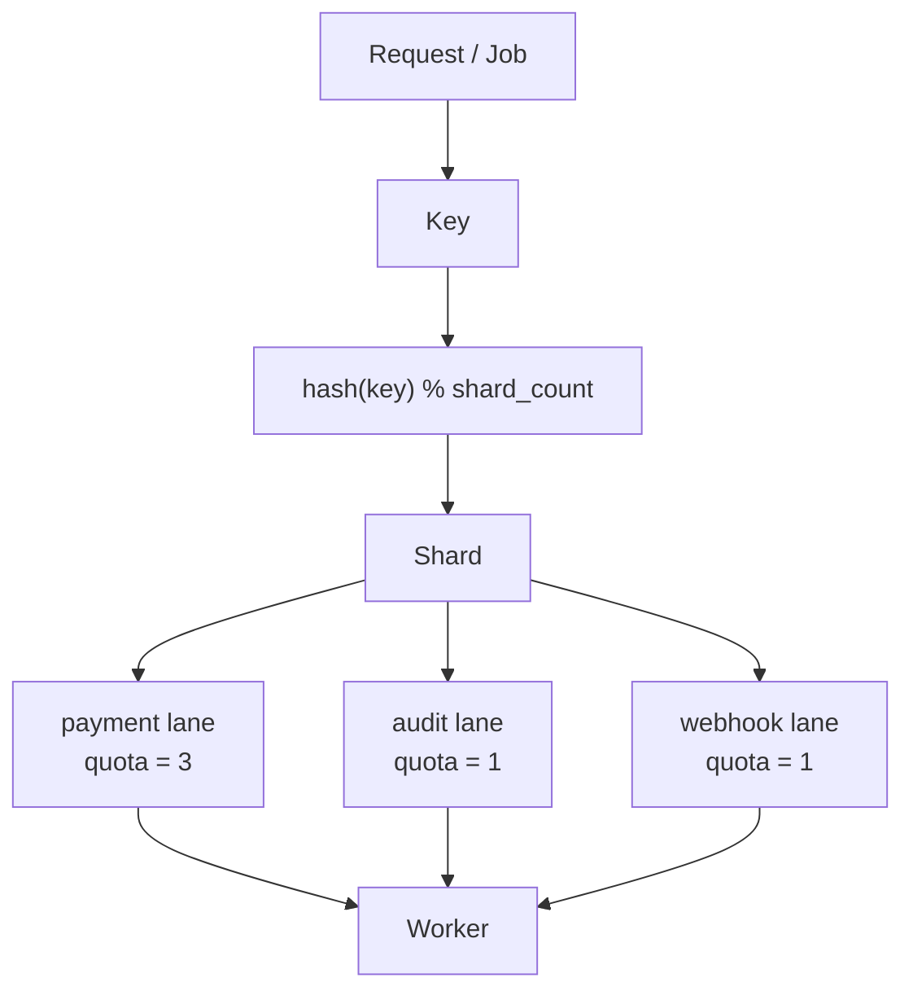

# go-keylane
A Go library for routing jobs by key into deterministic execution lanes, improving fairness, isolation, and tail-latency control in backend services.

It helps Go services execute asynchronous jobs more fairly by routing work through:

- **Key**: business identity such as tenant, customer, account, order, or user
- **Lane**: job class such as payment, audit, webhook, email, or enrichment
- **Shard**: concurrency isolation bucket derived from the key
- **Quota**: per-lane execution allowance
- **Worker**: goroutine that processes ready shards

## Mental Model



## What go-keylane is

`go-keylane` is an in-process execution control library for Go services.

It is designed to help with:

* noisy tenant/key isolation
* fairer execution between job classes
* bounded queueing
* controlled worker goroutine count
* lower allocation pressure through bounded internal structures

## What go-keylane is not

`go-keylane` is not:

* a replacement for the Go scheduler
* a replacement for the OS scheduler
* a distributed queue
* a Redis/Postgres-backed job system
* a guarantee that code will always run faster
* a way to avoid Go GC pauses

`go-keylane` does not avoid Go GC pauses.
`go-keylane` helps reduce GC pressure caused by uncontrolled concurrency, goroutine explosion, unbounded queues, and allocation bursts.

## Example Use Case

A payment service may want to process work by customer:

* `payment` lane gets higher quota
* `audit` lane gets lower quota
* `webhook` lane gets bounded background execution
## Core Data Model

`go-keylane` uses a simple but powerful data model to define how work is processed.

### Config
The `Config` struct defines the global settings for the keylane instance.

```go
type Config struct {
	ShardCount       int
	WorkerCount      int
	QueueSizePerLane int
	LaneQuotas       map[Lane]int
	Observability    ObservabilityConfig
}
```

### Lane
A `Lane` is a string identifier for a job class. Each lane has its own quota and queue.

```go
type Lane string
```

### Job
A `Job` is a unit of work that contains a routing key, a lane, and the function to execute.

```go
type Job struct {
	Key  string
	Lane Lane
	Run  func(context.Context) error
}
```

### Getting Started

> [!IMPORTANT]
> `go-keylane` is currently in an **experimental, pre-v0.1 state**. Phase 3 establishes the worker scheduler and public `Submit` API.

Internal models such as `InternalJob` and `LaneRegistry` are not part of the public API and are subject to change without notice.

```go
cfg := keylane.Config{
	ShardCount:       64,
	WorkerCount:      4,
	QueueSizePerLane: 1024,
	LaneQuotas: map[keylane.Lane]int{
		"payment": 3,
		"audit":   1,
		"webhook": 1,
	},
}

job := keylane.Job{
	Key:  "customer-123",
	Lane: "payment",
	Run: func(ctx context.Context) error {
		// Business logic here
		return nil
	},
}

q, err := keylane.New(cfg)
if err != nil {
	log.Fatal(err)
}

// Start workers
ctx, cancel := context.WithCancel(context.Background())
defer cancel()
if err := q.Start(ctx); err != nil {
	log.Fatal(err)
}

// Submit a fire-and-forget job
err = q.Submit(ctx, job)

// OR: Submit a job and wait for a value
future, err := keylane.SubmitValue(ctx, q, keylane.ValueJob[int]{
	Key:  "user-123",
	Lane: "payment",
	Run:  func(ctx context.Context) (int, error) { return 42, nil },
})
val, err := future.Await(ctx)
```

## Avoid Await inside keylane workers

> [!CAUTION]
> **Never call `Await` inside a worker `Run` function on the same queue.**
> 
> Doing so creates a high risk of **resource exhaustion deadlocks**. If your `WorkerCount` is 1, and the single worker processes a job that then blocks on `Await` for another job in the same queue, the system will deadlock forever.

### Deadlock Example

```go
q, _ := keylane.New(keylane.Config{WorkerCount: 1, ...})
_ = q.Start(ctx)

// This job will DEADLOCK
_ = q.Submit(ctx, keylane.Job{
    Key: "j1", Lane: "default", Run: func(ctx context.Context) error {
        f, _ := keylane.SubmitValue(ctx, q, otherJob)
        val, _ := f.Await(ctx) // Blocks the only worker; otherJob never runs
        return nil
    },
})
```

### Safe Alternatives
*   **Independent Submission**: Submit all required jobs from the caller side and aggregate results there using a `sync.WaitGroup` or by awaiting multiple futures sequentially.
*   **Decoupled Queues**: If jobs must wait for each other, use separate `Queue` instances to avoid circular dependencies in the worker pool.
*   **Larger Worker Pools**: While increasing `WorkerCount` can mitigate the issue, it only delays the problem. Architecture should ideally avoid worker-side blocking.

### Await Timeout and Starvation
Using `Await` with a timeout (e.g., `context.WithTimeout`) prevents the **caller** from blocking indefinitely. However, it does **not** solve the problem of **scheduler starvation**. If a worker is stuck in an `Await` call, it is unavailable to process other shards until the call returns (either through completion or timeout). The timeout merely protects the caller, not the queue's throughput.

## Documentation

- [Phase 2: Shard and Lane Queue](docs/phase-2-shard-and-lane-queue.md)
- [Phase 3: Worker Scheduler](docs/phase-3-worker-scheduler.md)
- [Phase 4: Future / SubmitValue / Await](docs/phase-4-future-submitvalue-await.md)
- [Phase 5: Backpressure & Shutdown](docs/phase-5-backpressure-and-shutdown.md)
- [Phase 6: Observability](docs/phase-6-observability.md)
