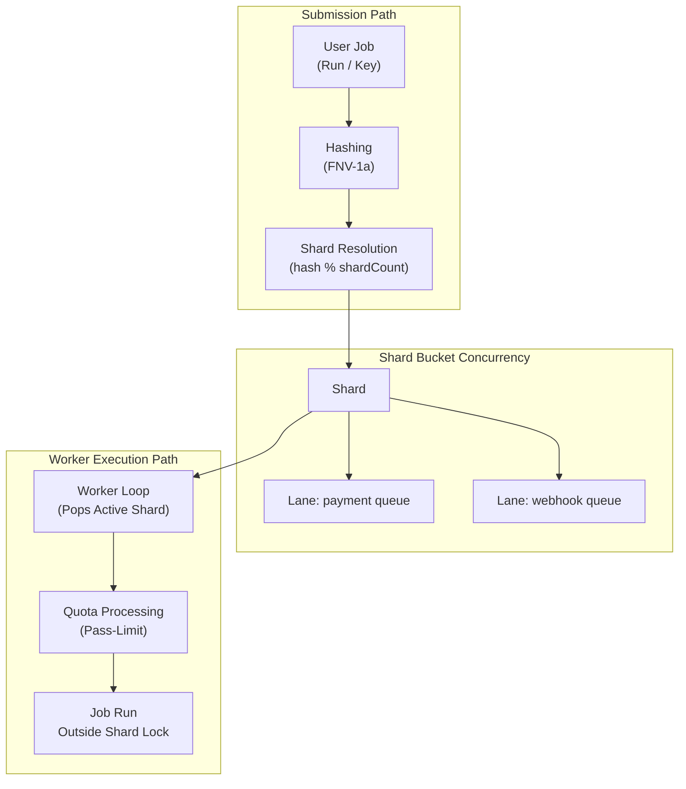

# Go-Keylane System Design & Architecture

This document describes the internal architecture, sharding mechanics, fairness models, and design trade-offs of the `go-keylane` library.

---

## 1. Why go-keylane

In modern concurrent backend services, a handful of high-volume tenants, API consumers, or aggressive background tasks can consume all execution resources (CPU, threads, memory). This results in resource starvation for quieter, high-value operations.

`go-keylane` provides a robust, in-process scheduling engine that uses **key-based routing** and **lane-based execution quotas** to help isolate noisy neighbors and allow quiet business pathways a fair share of scheduler processing time.

---

## 2. Core Model

The following flow diagram illustrates how a job progresses from submission to worker execution:

---

## 3. Key Model

The **Key** is the primary unit of resource partitioning. 
- **What makes a good key:** A durable, fine-grained identifier representing the context of execution (e.g., `tenant_id`, `customer_id`, `user_id`, or `account_id`).
- **Examples:**
  - In multi-tenant SaaS: `tenant_12389`
  - In e-commerce checkouts: `checkout_user_772`
- **What to avoid:** Ephemeral or highly high-churn keys (like random UUIDs per single request) as they dilute sharding isolation.

---

## 4. Lane Model

A **Lane** defines a class of work. Each lane is registered with a name and a relative execution quota defining its processing capacity:
- **Examples:**
  - `payment`: High priority, large quota allowance.
  - `audit`: Low priority background aggregation.
  - `webhook`: Unpredictable bulk event dispatching.
- Lanes allow distinct classes of work routed for the *same* key to run independently, preventing low-priority webhooks from delaying payment authorizations.

---

## 5. Shard Model

To minimize lock contention, keys are hashed into separate **Shards** via FNV-1a hashing:
$$\text{ShardID} = \text{Hash}(Key) \pmod{\text{ShardCount}}$$
- Each Shard operates as an isolated concurrency bucket holding its own set of lane queues.
- Lock synchronization is scoped strictly per shard. Workers lock only the popped shard to acquire batch work, significantly reducing global lock contention bottlenecks.

---

## 6. Worker Model

The scheduler pool runs $N$ persistent **Worker** goroutines. 
- Shards containing enqueued jobs are popped from a global `readyCh` channel.
- A worker locks the popped shard, pops a quota-limited batch of work, releases the shard lock immediately, and then executes the jobs **outside the shard lock**.
- This ensures that long-running user jobs never block other threads from enqueuing new work into that shard.

---

## 7. Quota Model

The scheduler uses **Pass-Level Lane Quotas** to encourage fairness:
- When a worker processes a shard, it drains each lane up to its specified `Quota` (e.g., 3 jobs for `payment`, 1 for `webhook`).
- If a lane contains more jobs than its quota, the remaining jobs are left in the lane queue, and the shard is requeued back into `readyCh`.
- This ensures that a burst of webhooks inside Shard A cannot starve payments in Shard A, supporting progress for all active lanes.

---

## 8. Future/Await Model

The request-response pathway wraps standard `Job` objects inside a generic `SubmitValue` helper, returning a completed or resolvable `Future[T]`:
- `Await(ctx)` blocks until the job finishes execution and returns the computation result.
- **Timeout Semantics:** Await respects context deadlines. If the context times out, Await returns `context.DeadlineExceeded` immediately.
- *Crucial safety property:* If a job execution fails, the future completes with Go's standard zero-value for type `T`.

---

## 9. Backpressure Model

When a specific lane inside Shard A reaches its bounded capacity limits, the queue scheduler applies backpressure:
- `Submit` returns `ErrQueueFull` immediately instead of blocking the enqueuing thread.
- `TrySubmit` returns a clean boolean `false`.
- This prevents memory exhaustion and allows callers to handle queue saturation gracefully (e.g., by shedding load or retrying).

---

## 10. Shutdown Model

Scheduler lifecycles are governed by concrete states:
- `Stop()` initiates a graceful shutdown sequence.
- **Drain Mode (`WithDrain(true)`):** The `Stop` call blocks the current thread until all enqueued jobs have been fully processed by active workers.
- **Idempotency:** Calling `Stop()` multiple times is completely safe and returns nil.

---

## 11. Observability Model

Adopters can retrieve a complete snapshot of queue health using `Stats()`:
- Provides total queued job counts, shard depths, queue-full drops, and execution errors.
- Evaluates queue wait times (`QueueWaitTotalNanos`) to measure queue latencies.
- Emits slow job hooks if a user task executes longer than a predefined threshold.

---

## 12. GC Pressure Shaping

> [!IMPORTANT]
> **go-keylane does not avoid Go GC pauses.**
> go-keylane helps reduce GC pressure caused by uncontrolled concurrency, goroutine explosion, unbounded queues, and allocation bursts.

The library achieves this by replacing dynamic slice re-allocations with bounded, map-free ring buffers (`laneQueue`) and utilizing `sync.Pool` to recycle intermediate slice containers inside worker loops.

---

## 13. What go-keylane is not

`go-keylane` is **not**:
- A replacement for the Go scheduler or the OS thread scheduler.
- A distributed queue or multi-node manager (operates strictly in-process).
- A persistent storage framework (operates strictly in-memory).

---

## 14. Design Trade-offs

- **In-process Only:** State is stored in volatile memory. If the process crashes, queued jobs are lost.
- **No Global Fairness:** Fairness is enforced locally *within* each shard, not across the entire cluster.
- **Contention vs Shard count:** More shards reduce lock contention but increase base memory allocations.
