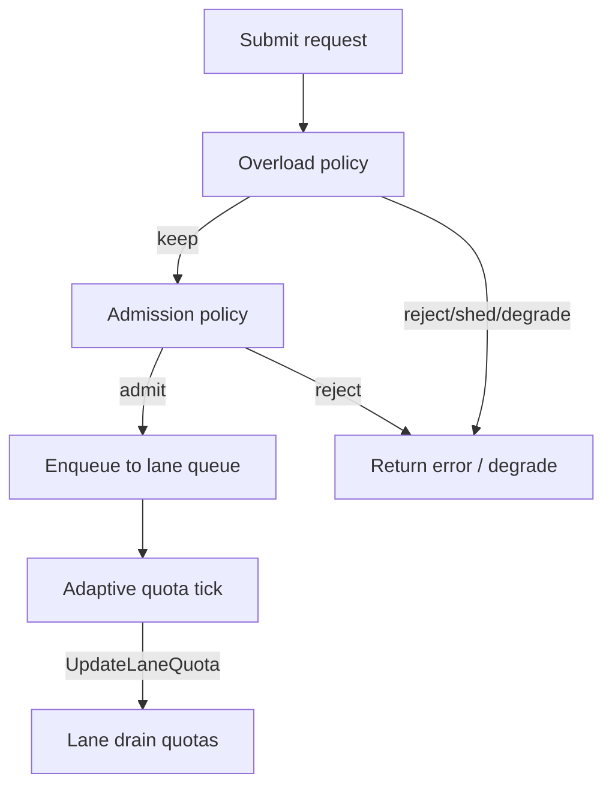

# Lane Priority (LaneClass)

KL-1402 introduced `LaneClass` as a priority classification shared across admission, overload, and adaptive quota. This document summarizes semantics and how subsystems interact.

## LaneClass values

| Class | Intent |
|-------|--------|
| `critical` | Protect under pressure; reject/shed later than lower classes; adaptive **increase** allowed, **decrease** disabled by default. |
| `normal` | Default balanced behavior for admission, overload, and adaptive adjustments. |
| `background` | Lower priority under contention; adaptive **decrease** allowed (including on localized overload signals), **increase** disabled by default. |
| `best-effort` | Most aggressive shedding/rejection under pressure; same adaptive defaults as `background`. |

`critical` does **not** mean unlimited capacity — it only shifts thresholds and adaptive policy defaults relative to other classes.

## Admission (KL-1401)

Admission evaluates global pressure and per-lane depth before enqueue. Class sets default reject ratios and max depth; per-lane overrides live in `AdmissionPolicy`.

See [admission-control.md](admission-control.md).

## Overload (KL-1403)

Overload runs **before** admission when both are enabled. Class influences reject/shed/degrade thresholds. Per-lane counters (`OverloadRejected`, `OverloadShed`, `OverloadDegrade`) feed observability and adaptive quota signals.

See [overload-policy.md](overload-policy.md).

## Adaptive quota (KL-1404)

Adaptive quota uses class for default `AllowIncrease` / `AllowDecrease`, decrease priority ordering (best-effort before background), and localized overload decrease eligibility.

Explicit `LaneAdaptivePolicy` entries override class defaults lane-by-lane. Setting both allow flags to `false` creates a fixed lane.

See [adaptive-quota.md](adaptive-quota.md) and [adaptive-tuning.md](adaptive-tuning.md).

## Interaction diagram

## Related docs

- [admission-control.md](admission-control.md)
- [overload-policy.md](overload-policy.md)
- [adaptive-quota.md](adaptive-quota.md)
