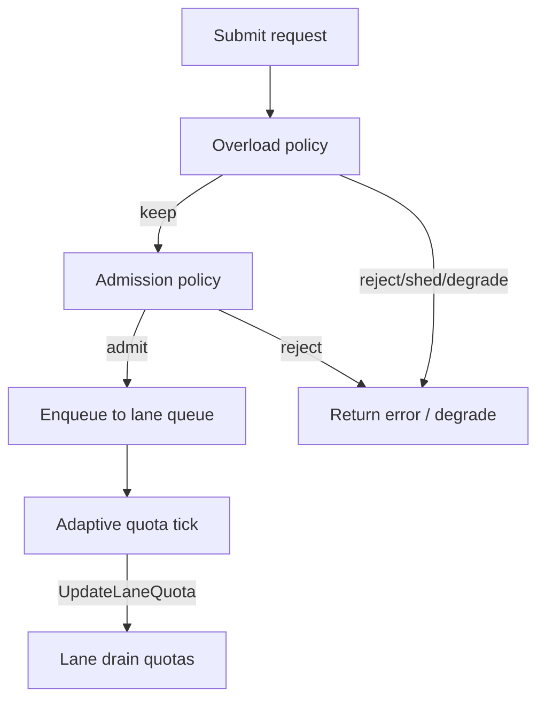

# Lane Priority (LaneClass)

## Overview

`LaneClass` is a priority classification shared across **admission**, **overload**, and **adaptive quota** (KL-1402–KL-1404). It does not reorder FIFO work inside a lane queue; it changes **thresholds** and **default policies** so important traffic is protected under pressure.

Classify lanes by **business value**, not by team name. A small static set of lanes (`payment`, `webhook`, `report`) keeps observability and policy manageable.

---

## Lane class model

| Class | Constant | Intent |
|-------|----------|--------|
| **Critical** | `LaneCritical` | Protect under pressure; reject/shed later than lower classes; adaptive **increase** allowed, **decrease** disabled by default. |
| **Normal** | `LaneNormal` | Default balanced behavior for admission, overload, and adaptive adjustments. |
| **Background** | `LaneBackground` | Lower priority under contention; adaptive **decrease** allowed (including localized overload signals), **increase** disabled by default. |
| **Best-effort** | `LaneBestEffort` | Most aggressive shedding/rejection under pressure; same adaptive defaults as background. |

`critical` does **not** mean unlimited capacity — critical lanes still hit `MaxQueueDepth`, global pressure thresholds, and overload rules. It means the lane is **protected relative to** lower classes, not that it never rejects.

### Example mapping

| Workload | Suggested class |
|----------|-----------------|
| Payment authorization | `critical` |
| User profile read | `normal` |
| Webhook ingestion | `background` |
| Report generation | `best_effort` |

> **Warning:** Do not mark every lane as critical. If every lane is critical, no lane is critical.

---

## Admission (KL-1401 / KL-1402)

Admission evaluates per-lane depth and global pressure **before enqueue**. Class sets default `RejectAboveRatio` and `MaxQueueDepth`; per-lane overrides use `LanePolicy` in `AdmissionPolicy`.

```go
version, err := queue.UpdateAdmissionPolicy(keylane.AdmissionPolicy{
    DefaultClass:            keylane.LaneNormal,
    DefaultRejectAboveRatio: 0.90,
    DefaultMaxQueueDepth:    1024,
    Lanes: []keylane.LanePolicy{
        {
            Lane:             "payment",
            Class:            keylane.LaneCritical,
            RejectAboveRatio: 0.98,
            MaxQueueDepth:    2048,
        },
        {
            Lane:             "report",
            Class:            keylane.LaneBestEffort,
            RejectAboveRatio: 0.60,
            MaxQueueDepth:    256,
        },
    },
})
```

See [admission-control.md](admission-control.md).

---

## Overload (KL-1403)

Overload runs **before** admission when both are enabled. Class influences reject/shed/degrade thresholds. Per-lane counters feed observability and adaptive signals.

```go
version, err := queue.UpdateOverloadPolicy(keylane.OverloadPolicy{
    Default: keylane.LaneOverloadPolicy{
        Class:            keylane.LaneNormal,
        RejectAboveRatio: 0.90,
        MaxQueueDepth:    512,
    },
    Lanes: []keylane.LaneOverloadPolicy{
        {
            Lane:             "payment",
            Class:            keylane.LaneCritical,
            RejectAboveRatio: 0.95,
            MaxQueueDepth:    512,
        },
        {
            Lane:             "report",
            Class:            keylane.LaneBestEffort,
            RejectAboveRatio: 0.70,
            MaxQueueDepth:    64,
        },
    },
})
```

See [overload-policy.md](overload-policy.md).

---

## Adaptive quota (KL-1404)

Adaptive quota uses class for default `AllowIncrease` / `AllowDecrease`, decrease priority (best-effort before background), and localized overload decrease eligibility.

Explicit `LaneAdaptivePolicy` overrides class per lane. Set both allow flags to `false` for a fixed lane.

See [adaptive-quota.md](adaptive-quota.md) and [adaptive-tuning.md](adaptive-tuning.md).

---

## Interaction diagram



---

## Troubleshooting

### Critical lane still has high queue wait

- **Workers or quota** — High queue wait with normal run duration usually means scheduler backlog. Increase `WorkerCount` or lane drain quota (manually or via adaptive max bound).
- **Hot shard** — One noisy `Key` can saturate a shard. Check `DebugSnapshot().HotShards`.
- **Not admission-proof** — Critical rejects later but still enforces `MaxQueueDepth` and pressure ratios.

### Best-effort lane rejected too often

- **Expected under load** — Best-effort is shed/rejected earlier by design. Move latency-sensitive work to `normal` or `critical` if it must survive pressure.
- **Thresholds too aggressive** — Raise `RejectAboveRatio` or `MaxQueueDepth` only if capacity truly exists downstream.
- **Overload vs admission** — Confirm which layer rejected (overload counters vs `AdmissionRejected`). Overload runs first.

---

## Related docs

- [admission-control.md](admission-control.md)
- [overload-policy.md](overload-policy.md)
- [adaptive-quota.md](adaptive-quota.md)
- [adaptive-observability.md](adaptive-observability.md)
