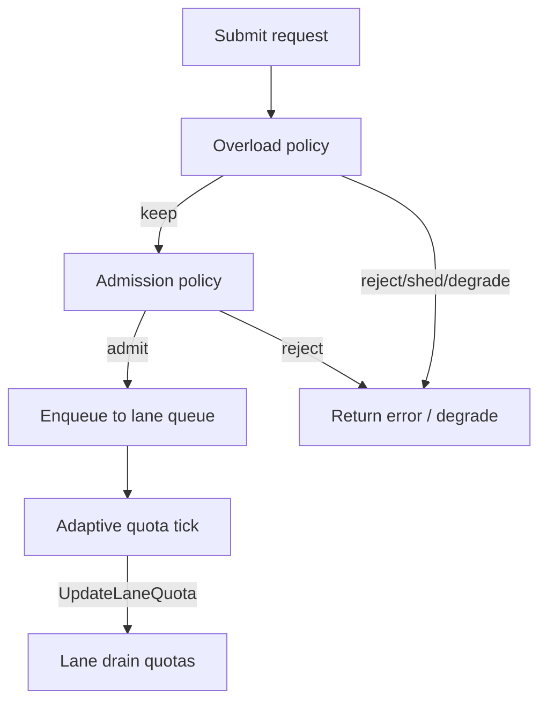

# Lane Priority (LaneClass)

## Overview

`LaneClass` is a priority classification shared across **admission**, **overload**, and **adaptive quota**. It does not reorder FIFO work inside a lane queue; it changes **thresholds** and **default policies** so important traffic is protected under pressure.

Classify lanes by **business value**, not by team name. A small static set of lanes (`payment`, `webhook`, `report`) keeps observability and policy manageable.

Lane policies are configured via `UpdateAdmissionPolicy`, `UpdateOverloadPolicy`, and `AdaptiveQuotaPolicy` — not a `Config.LanePolicies` field. v0.4.0 spec’s `Config.LanePolicies` example is illustrative; use `AdmissionPolicy.Lanes` at runtime.)

---

## Lane class model

| Class | Constant | Summary |
|-------|----------|---------|
| Critical | `LaneCritical` | Protect under pressure |
| Normal | `LaneNormal` | Default business traffic |
| Background | `LaneBackground` | Useful but should not hurt critical work |
| Best-effort | `LaneBestEffort` | Safe to reject or shed early |

`critical` does **not** mean unlimited capacity — critical lanes still hit `MaxQueueDepth`, global pressure thresholds, and overload rules.

### Critical lane

Must be protected during pressure. Admission and overload reject later than lower classes. Adaptive quota **increase** is allowed by default; **decrease** is disabled so critical drain quotas are not automatically shrunk under load.

Use for payment authorization, fraud checks, or other work where rejection has high business cost.

### Normal lane

Default for most business traffic. Balanced admission, overload, and adaptive behavior — both increase and decrease are allowed by default when adaptive quota is enabled.

Use for standard API reads/writes that are important but not as latency-sensitive as critical paths.

### Background lane

Lower priority under contention. Rejects and sheds earlier than `normal`. Adaptive **decrease** is allowed (including on localized overload signals); **increase** is disabled by default so background lanes do not grow during relief.

Use for webhook ingestion, async fan-out, or work that can wait without blocking user-facing paths.

### Best-effort lane

Most aggressive shedding and rejection under pressure. Same adaptive defaults as `background`. Safe to drop or shed when the system is busy.

Use for report generation, analytics, cache warming, or any work with an acceptable fallback or retry path.

---

## Per-lane admission policy

Admission gates **new** submissions before enqueue using per-lane `LanePolicy` entries inside `AdmissionPolicy`. Each entry sets:

- `Class` — priority tier (see sections above)
- `RejectAboveRatio` — global pressure threshold for this lane
- `MaxQueueDepth` — per-lane queued job cap across all shards

Update at runtime:

```go
version, err := queue.UpdateAdmissionPolicy(keylane.AdmissionPolicy{ ... })
snap := queue.CurrentAdmissionPolicy()
```

See [admission-control.md](admission-control.md) for HTTP and request integration.

---

## Per-lane max queue depth

`MaxQueueDepth` limits how many jobs may wait in a lane’s queues **across all shards**. It protects scheduler memory and prevents one lane from filling the entire queue budget during a localized spike, even when global pressure is still low.

Size `MaxQueueDepth` from expected burst size and acceptable wait — typically a fraction of `ShardCount * QueueSizePerLane` per lane, with higher caps for critical lanes and lower caps for best-effort lanes.

---

## Per-lane reject threshold

`RejectAboveRatio` compares lane policy against **global** `TotalDepthRatio` (fraction of total queue capacity in use). When depth ratio meets or exceeds the threshold, admission rejects before enqueue.

Critical lanes use higher ratios (e.g. `0.95–0.98`) so they tolerate more global pressure. Best-effort lanes use lower ratios (e.g. `0.60–0.70`) so they back off earlier. The same field exists on `LaneOverloadPolicy` for overload decisions.

---

## Choosing lane classes

Use these criteria when assigning a class:

| Criterion | Favor higher class (critical/normal) | Favor lower class (background/best-effort) |
|-----------|----------------------------------------|---------------------------------------------|
| Latency sensitivity | User-visible, SLO-bound | Batch or deferrable |
| Cost of drop/reject | Revenue or compliance impact | Retry or skip is acceptable |
| Blast radius | Many tenants depend on it | Isolated or internal |
| Fallback available | No cheaper path | Cache, stale read, or queue-later |

Example mapping:

| Workload | Suggested class |
|----------|-----------------|
| Payment authorization | `critical` |
| User profile read | `normal` |
| Webhook ingestion | `background` |
| Report generation | `best_effort` |

---

## Anti-patterns

- **Do not mark every lane as critical.** If every lane is critical, no lane is protected relative to others.
- **Do not use tenant or request IDs as lane names.** Lanes must be a small static set; route tenants with `Key`, not lane strings. See [observability.md](observability.md).
- **Do not disable admission on all lanes and expect overload alone to cap memory.** Overload and admission complement each other; depth caps matter even when global pressure is low.
- **Do not assume class replaces capacity planning.** Workers, quotas, and downstream limits still bound throughput.

---

## Examples

### Admission policy

```go
version, err := queue.UpdateAdmissionPolicy(keylane.AdmissionPolicy{
    DefaultClass:            keylane.LaneNormal,
    DefaultRejectAboveRatio: 0.90,
    DefaultMaxQueueDepth:    1024,
    Lanes: []keylane.LanePolicy{
        {
            Lane:             "payment",
            Class:            keylane.LaneCritical,
            RejectAboveRatio: 0.98,
            MaxQueueDepth:    2048,
        },
        {
            Lane:             "report",
            Class:            keylane.LaneBestEffort,
            RejectAboveRatio: 0.60,
            MaxQueueDepth:    256,
        },
    },
})
```

### Overload policy

```go
version, err := queue.UpdateOverloadPolicy(keylane.OverloadPolicy{
    Default: keylane.LaneOverloadPolicy{
        Class:            keylane.LaneNormal,
        RejectAboveRatio: 0.90,
        MaxQueueDepth:    512,
    },
    Lanes: []keylane.LaneOverloadPolicy{
        {
            Lane:             "payment",
            Class:            keylane.LaneCritical,
            RejectAboveRatio: 0.95,
            MaxQueueDepth:    512,
        },
        {
            Lane:             "report",
            Class:            keylane.LaneBestEffort,
            RejectAboveRatio: 0.70,
            MaxQueueDepth:    64,
        },
    },
})
```

See [overload-policy.md](overload-policy.md) and [adaptive-quota.md](adaptive-quota.md) for adaptive lane entries.

---

## Adaptive quota

Adaptive quota uses class for default `AllowIncrease` / `AllowDecrease`, decrease priority (best-effort before background), and localized overload decrease eligibility.

Explicit `LaneAdaptivePolicy` overrides class per lane. Set both allow flags to `false` for a fixed lane.

See [adaptive-tuning.md](adaptive-tuning.md).

---

## Interaction diagram



---

## Troubleshooting

### Critical lane still has high queue wait

- **Workers or quota** — High queue wait with normal run duration usually means scheduler backlog. Increase `WorkerCount` or lane drain quota (manually or via adaptive max bound).
- **Hot shard** — One noisy `Key` can saturate a shard. Check `DebugSnapshot().HotShards`.
- **Not admission-proof** — Critical rejects later but still enforces `MaxQueueDepth` and pressure ratios.

### Best-effort lane rejected too often

- **Expected under load** — Best-effort is shed/rejected earlier by design. Move latency-sensitive work to `normal` or `critical` if it must survive pressure.
- **Thresholds too aggressive** — Raise `RejectAboveRatio` or `MaxQueueDepth` only if capacity truly exists downstream.
- **Overload vs admission** — Confirm which layer rejected (overload counters vs `AdmissionRejected`). Overload runs first.

---

## Related docs

- [admission-control.md](admission-control.md)
- [overload-policy.md](overload-policy.md)
- [adaptive-quota.md](adaptive-quota.md)
- [adaptive-observability.md](adaptive-observability.md)
