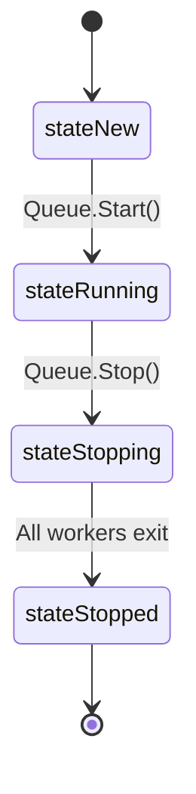

# Phase 5: Backpressure & Shutdown Architecture

This document describes the design, API, and implementation details of Phase 5 (Backpressure and Shutdown) in `go-keylane`.

## Lifecycle States

The scheduler manages a state machine to guarantee safe job submission, graceful termination, and complete prevention of race conditions during queue shutdown.



1. **`stateNew`**:
   - The queue is constructed but not yet started.
   - Job submissions via `Submit` and `SubmitValue` are accepted and buffered.
   - Non-blocking submissions via `TrySubmit` fail, returning `false`.
2. **`stateRunning`**:
   - Workers are actively running and processing jobs.
   - All submissions are allowed.
3. **`stateStopping`**:
   - The queue is transitioning to shutdown.
   - New submissions (via `Submit`, `TrySubmit`, `SubmitValue`) are instantly rejected.
4. **`stateStopped`**:
   - Workers have completely shut down and all resources have been reclaimed.
   - New submissions are instantly rejected.

---

## Error Sentinel Models & `errors.Is`

Keylane exposes four standard public sentinel errors to help clients handle queue lifecycle and capacity bounds:

- **`ErrQueueFull`**: Returned when the target shard's lane queue is full.
- **`ErrStopped`**: Returned when trying to submit to a queue that is currently stopping or has already stopped.
- **`ErrNotStarted`**: Returned internally when submitting to a queue that hasn't started yet.
- **`ErrNilQueue`**: Returned if a `nil` Queue reference is passed to job submitters.

### Example: Error Handling with `errors.Is`

Always use Go's standard `errors.Is` comparison rather than direct equality checks to ensure robust compatibility with wrapped errors:

```go
err := q.Submit(ctx, job)
if err != nil {
    if errors.Is(err, keylane.ErrQueueFull) {
        // Apply application backpressure (e.g. return HTTP 429 Too Many Requests)
        return
    }
    if errors.Is(err, keylane.ErrStopped) {
        // Failover to secondary fallback queue
        return
    }
}
```

---

## Public Job Submission APIs

Keylane provides three public entry points for submitting work, catering to different concurrency and response needs.

### 1. `Submit` (Blocking Submission)
```go
func (q *Queue) Submit(ctx context.Context, job Job) error
```
- **Behavior**: Submits a job to the queue. If the targeted lane's queue capacity is saturated, it immediately returns `ErrQueueFull` (non-blocking backpressure).
- **Errors**: Returns `ErrStopped` if the queue is shutting down/stopped.

### 2. `TrySubmit` (Non-Blocking Submission)
```go
func (q *Queue) TrySubmit(job Job) bool
```
- **Behavior**: A completely non-blocking, fast-fail variant.
- **Return Value**: Returns `true` if enqueued successfully; returns `false` if:
  - The queue is not started yet.
  - The queue is stopping/stopped.
  - The targeted lane's queue is capacity-saturated (`ErrQueueFull`).

### 3. `SubmitValue` (Request-Response Submission)
```go
func SubmitValue[T any](ctx context.Context, q *Queue, job ValueJob[T]) (Future[T], error)
```
- **Submission Failures**: If submission fails due to the queue being stopped (`ErrStopped`) or capacity-saturated (`ErrQueueFull`), `SubmitValue` will:
  1. Return the sentinel error (`ErrStopped` or `ErrQueueFull`) directly from the call.
  2. Return a **pre-completed `Future`** holding that exact sentinel error. This guarantees that calling `Await()` on the returned future will safely return the same error without blocking.

---

## Graceful Shutdown Options

Graceful shutdown is triggered by calling:

```go
func (q *Queue) Stop(ctx context.Context, opts ...StopOption) error
```

### Options

1. **`WithDrain(true)`** (Default):
   - Waits for all enqueued and in-flight jobs to finish before stopping.
   - If the passed `ctx` times out, `Stop` immediately cancels workers and exits, returning the context error (e.g. `context.DeadlineExceeded`).
2. **`WithDrain(false)`**:
   - Skips waiting for queued jobs.
   - Cancels worker context immediately and exits as soon as running workers terminate.

### Safe Concurrent Coordination
Multiple concurrent calls to `Stop()` are safe and fully synchronized. Active concurrent calls will block until worker shutdown is complete, returning the same completion error (or context timeout if their individual context expires).

---

## Bounded Memory & Bounded Queues

### Fine-Grained Backpressure Scoping
Backpressure in `go-keylane` is extremely precise. When a lane queue inside a specific shard fills up, backpressure is triggered **only** for job submissions targeting that specific **Shard** AND **Lane**. Jobs targeting other shards or other lanes in the same shard will continue to succeed without blocking or being rejected.

### Important: No-Persistence Caveat
> [!WARNING]
> **Keylane is a 100% in-memory queueing library and does not persist state to disk.**
> 
> Stopping the queue with `WithDrain(false)` or crashing abnormally will result in the immediate and permanent discarding of any buffered queue contents. If you require persistence guarantees, you must implement WAL/journaling or utilize a distributed message broker (e.g. RabbitMQ, Kafka) upstream of Keylane.
